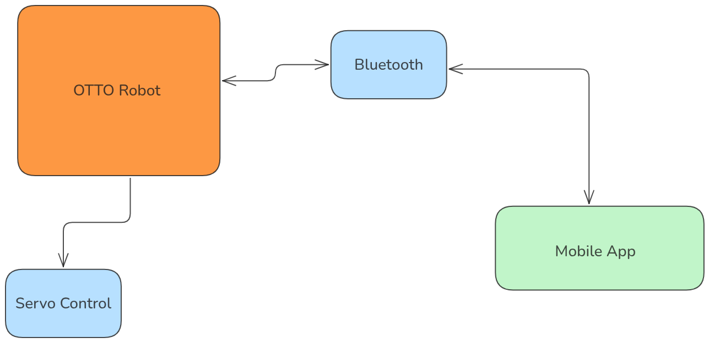

## OTTO Robot

Otto robot is a mini robot controlled via a mobile app to perform movements:

- Go forward
- Go backward
- Go left
- Go right

This project was initiated by 4C-ISI. They provided the 3D-printed parts of the robot, and we assembled and brought life into the robot.

## Materials:

The materials used are:

- ESP32
- 4 Servo motors
- 1 Ultrasonic sensor
- LED
- Switch

Here is a hardware overview:

  

> **Important:**

- The main issue we faced is power. How can we provide power for the robot?

The straightforward approach we followed was to provide power via a normal USB and a phone charger (SAMSUNG).

Once we added Bluetooth, the ESP32 started rebooting. We were consuming more power than the charger provided, so we sought to upgrade the charger.

The best solution we have found is a **30W charger**.

For the best performance, **YOU NEED TO POWER THE ROBOT WITH A 30W CHARGER**.

We are looking to power up the robot with a battery, but it is under development.

## How does the Code work?

This is an overview of how the code works. As I mentioned before, we get the commands from a mobile app via Bluetooth, then we handle those commands accordingly so the robot moves.

  

Above is a general design of how we approached the requirement.

  

## What is next:

- Find a solution to power up the robot from a battery.
- Create a PCB for the robot.
- Add support for the Ultrasonic sensor.

