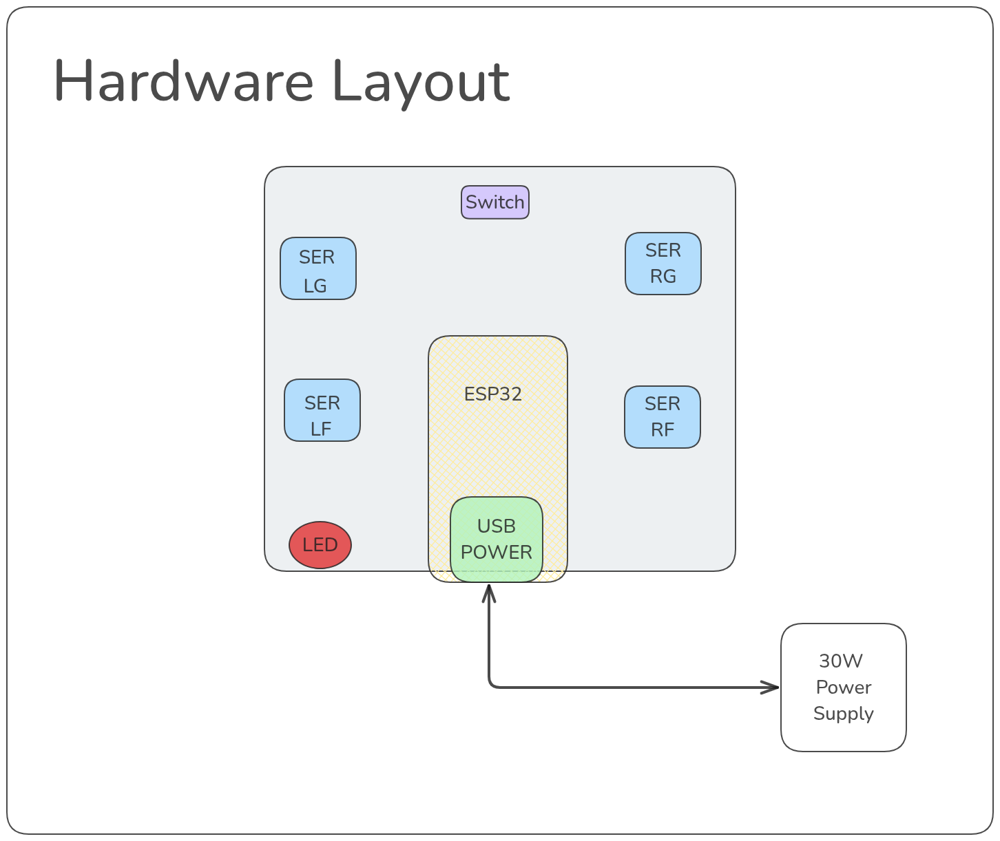

## OTTO Robot:

  

Otto robot est un mini-robot contrôlé via une application mobile pour effectuer des mouvements :

- Avancer
- Reculer
- Tourner à gauche
- Tourner à droite

Ce projet a été initié par 4C-ISI. Ils ont fourni les pièces imprimées en 3D du robot, et nous avons assemblé et donné vie au robot.

## Matériaux :

Les matériaux utilisés sont :

- ESP32
- 4 servomoteurs
- 1 capteur à ultrasons
- LED
- Interrupteur

Voici un aperçu du matériel :

  

> **Important :**

- Le principal problème auquel nous avons été confrontés est l'alimentation. Comment pouvons-nous alimenter le robot ?

L'approche la plus simple que nous avons suivie a été de fournir de l'énergie via un port USB classique et un chargeur de téléphone (SAMSUNG).

Une fois le Bluetooth ajouté, l'ESP32 a commencé à redémarrer. Nous consommions plus d'énergie que ce que le chargeur fournissait, nous avons donc cherché à améliorer le chargeur.

La meilleure solution que nous avons trouvée est un **chargeur de 30W**.

Pour de meilleures performances, **VOUS DEVEZ ALIMENTER LE ROBOT AVEC UN CHARGEUR DE 30W**.

Nous cherchons à alimenter le robot avec une batterie, mais cela est en cours de développement.

## Comment fonctionne le code ?

Voici un aperçu du fonctionnement du code. Comme mentionné précédemment, nous recevons les commandes d'une application mobile via Bluetooth, puis nous traitons ces commandes en conséquence pour que le robot se déplace.

  

Ci-dessus, un schéma général de la façon dont nous avons abordé le besoin.

  

## Quelles sont les prochaines étapes :

- Trouver une solution pour alimenter le robot avec une batterie.
- Créer un circuit imprimé (PCB) pour le robot.
- Ajouter la prise en charge du capteur à ultrasons.